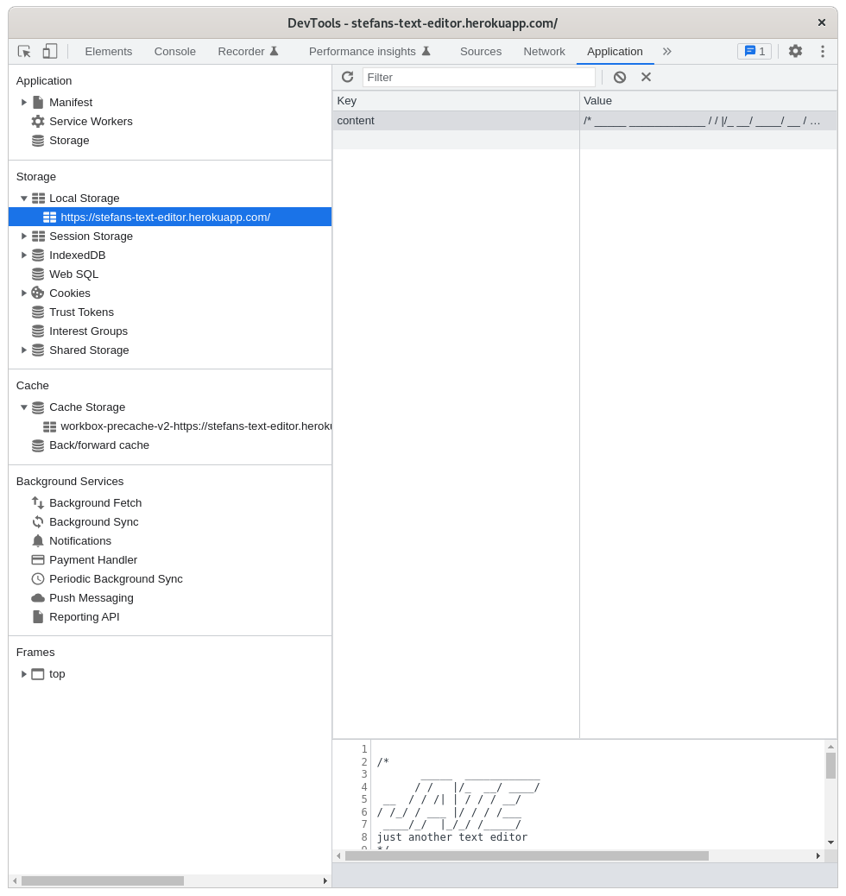

# UTOR-MOD19-CHAL01-Text-Editor-PWA
University of Toronto - Module 19 - Challenge 01

## Description

Repository containing the code for the Text Editor Progressive Web Application (PWA). This is a both a front and back-end application that takes user input and saves it to the local storage and the local IndexedDb. The user is given a text editor where the user can enter any data or snippets of code that will be saved for future use. The application can also be installed on user's device and is available offline (from the machine that the user has been using the application). 

Below is the image of the application in user's browser.


Below is the image of of the applicatoin installed on the user's machine.


Below is the image of the manifest as accessed through the chrome dev tools.


Below is the image of the service worker as accessed through the chrome dev tools.


Below is the image of the local storage as accessed through the chrome dev tools.


Below is the image of the indexedDb as accessed through the chrome dev tools.


Below is the image of the cache storage as accessed through the chrome dev tools.


## Table of Contents

- [Installation](#installation)
- [Functionality](#functionality)
- [Usage](#usage)
- [Credits](#credits)
- [Tests](#tests)
- [License](#license)
- [Walktrough](#walkthrough)
- [Future Development](#future-development)

## Installation

No special installation requirements. Simply visit https://stefans-text-editor.herokuapp.com/ to use the application.


back to [Table of Contents](#table-of-contents)


## Functionality

The following discusses at a high level about some of the features of the website. Detailed code implementation can be found as comments in the JS files.


### Manifest:

Manifest is required in order for the app to be installable. The manifest contains basic information about the app as well as differently sized icons.

### Service Worker:

A service worker is a JavaScript file that runs in the background of your application and can listen for and intercept network requests. The service worker here is used to primarily cache assets in order to make them available to the user offline.

### Webpack:

Webpack is a static module bundler that combines every module of the project into bundles and serve them. The number of bundles vary depending on the entry points specified in the configuration file.


back to [Table of Contents](#table-of-contents)

## Usage

To access application
1. Go to https://stefans-text-editor.herokuapp.com/ to access the application
2. From the editor screen, add, edit, or delete data
3. Changes will be automatically saved once the user moves away from the editor.

To view browser storage:
1. Go to https://stefans-text-editor.herokuapp.com/ to access the application
2. Right click on the page and select inspect.
3. In the chrome dev tools, navigate to the "applications" tab.
4. Go through the following links from the left hand side and inspect
    - Application:
        - Manifest
        - Service Workers
    - Storage
        - local storage
        - IndexedDb
    - Cache
        - Cache Storage

To install application:
1. Go to https://stefans-text-editor.herokuapp.com/ to access the application
2. Click on the install button on the top left.
3. Click Install on the prompt
    - the application will launch in a separate window
    - NOTE: the install button will disappear 3 seconds after the click

To launch installed application:
1. Open Chrome
2. Type the following in Chrome's address bar 
```md 
    chrome://apps
```
3. Select the JATE application from the resulting list

back to [Table of Contents](#table-of-contents)


## Credits
n/a

back to [Table of Contents](#table-of-contents)


## Tests

All tests have been performed manually using Chrome.

back to [Table of Contents](#table-of-contents)


## License

Please refer to the LICENSE in the repo.

back to [Table of Contents](#table-of-contents)


## Walkthrough

No walkthrough video required

back to [Table of Contents](#table-of-contents)


## Future Development

Here are some of the items to be considered for future development.
1. have the ability to connect to external database to store data.
2. have all code snippets in separate documents that can be stored, accessed, modified, or deleted individually


back to [Table of Contents](#table-of-contents)
